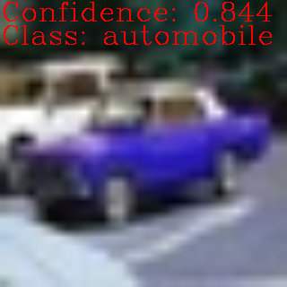
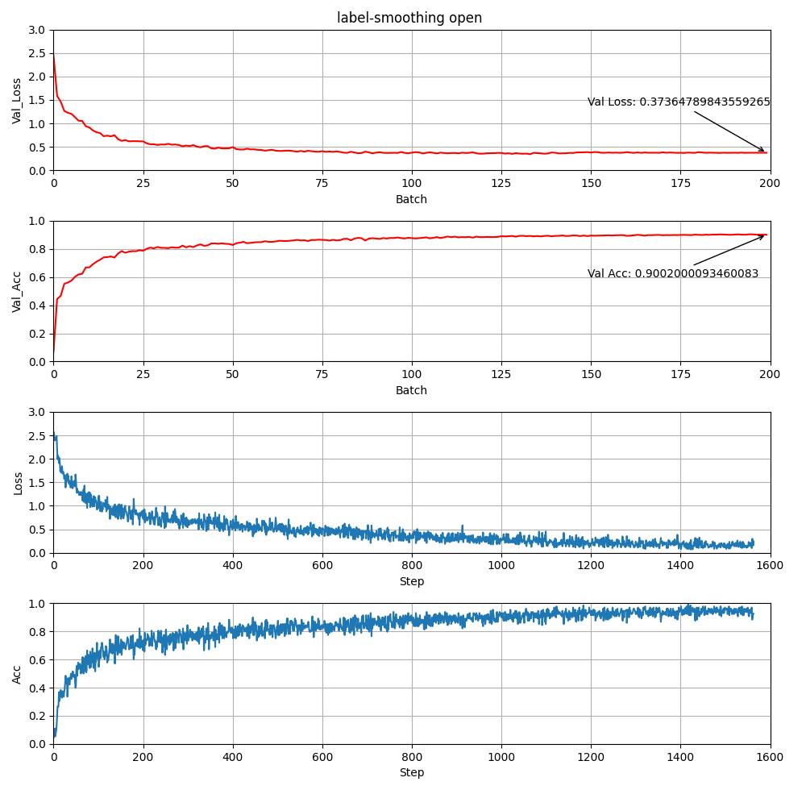

# Transformer Implementation for Image Classification based on CIFAR10 (A Course assignment for Artificial Intelligence Module at Tsinghua University)

PyTorch implementation for image classification using Transformer based on ViT paper [[Dosovitskiy, A.(ICLR'21)]](https://openreview.net/forum?id=YicbFdNTTy) **modified to obtain over 90% accuracy**(, I know, which is easily reached using CNN-based architectures.) **FROM SCRATCH on CIFAR-10 with small number of parameters (= 6.3M, originally ViT-B has 86M)**. If there is some problem, let me know kindly :) Any suggestions are welcomed!


## 1. Quick Start

1. **Install packages**
```sh
cd ViT-CIFAR/
bash setup.sh
```

2. **Train ViT on CIFAR-10**

```sh
python3 main.py --dataset c10 --label-smoothing --autoaugment
```

3. **Visualization of training results**

You need to modify the read path according to the actual training log file, see for details [train_plot.py](/train_plot.py)
```sh
python3 train_plot.py
```

4. **Visualize trained model inference**

You need to modify the **Image Path** and **Model Path** to be tested in the [main.py](/main.py), then execute:
```sh
python3 main.py --predict
```
You can see the resulting image below.




## 2. Results

|Dataset|Acc.(%)|Time(hh:mm:ss)|
|:--:|:--:|:--:|
|CIFAR-10|**90.02**|02:14:22|

* Number of parameters: 6.3 M
* Device: Nvidia 2070Ti (single GPU)


### 2.1 CIFAR-10
* Accucary && Loss



## 3. Hyperparams

|Param|Value|
|:--|:--:|
|Epoch|200|
|Batch Size|128|
|Optimizer|Adam|
|Weight Decay|5e-5|
|LR Scheduler|Cosine|
|(Init LR, Last LR)|(1e-3, 1e-5)|
|Warmup|5 epochs|
|Dropout|0.0|
|AutoAugment|True|
|Label Smoothing|0.1|
|Heads|12|
|Layers|7|
|Hidden|384|
|MLP Hidden|384|
